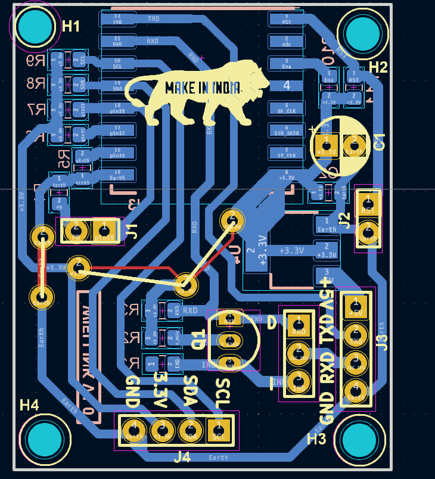

# 🧠 PCB & Schematics Portfolio

Welcome to my showcase of schematic diagrams and PCB layout designs created using **KiCad**.  
This repository is dedicated to demonstrating my **hands-on PCB design skills** and attention to detail in circuit development.

This all sample just created by myself, I can't show any company's property which is designed by me

---

## 🛠️ Tools Used

- 🧰 KiCad (Schematic and PCB Layout Editor)
- 🧮 Experience with footprints, nets, ERC/DRC checks
- 📏 Manual routing and via optimization
- 📐 Multi-layer PCB designs (2-layer, 4-layer)

---

## 📸 Sample Designs

| PCB Layout | 3D View (Optional) |
|-------------|---------------------|
|  |  |

---

## 💡 Highlights

- Designed both analog and digital circuits
- Created custom footprints and symbols when needed
- Followed standard net naming and bus conventions
- Handled routing for signal integrity and EMI control
- Proper clearance and trace width planning for power tracks

---

## 📜 Disclaimer

These designs are for **learning, personal development, and professional showcasing** only.  
Do not reuse or manufacture without permission.

---
